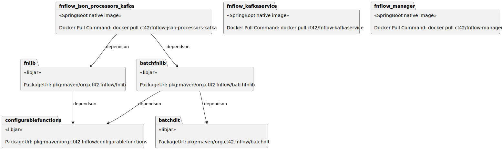

# fnflow
Streamed data processing with Java functions as configurable processors using Spring Boot.  
Platform documentation can be found on https://fnflow.ct42.org/.

## Configurable Functions
In stream processing, the very same logic would be applied multiple times but differently configured in the same pipeline.
Let's take string processing as an example.
We would replace the word `cats` with the word `birds` and the word `dogs` with the word `cats` in the following input phrase: "dogs and cats are not being friends".
This would result to "cats and birds are not being friends".
This can be done with one function finding  pattern and replacing it with a token. This function has to be applied two times in the pipeline, first time configured with pattern=cats and replace=birds and the second time with pattern=dogs and replace=cats.

Passing configuration to functions is not supported by Spring Cloud Function out of the box. This project want's to add this support.

Parameters for functions will be configured via application configuration.
```yaml
cfgfns:
  replace:
    cats-birds:
      pattern: cats
      replace: birds
    dogs-cats:
      pattern: dogs
      replace: cats
spring.cloud.function.definition: cats-birds|dogs-cats
```
Assuming we have a function implementation named `replace` with two parameters: `pattern` and `replace`.
The configuration above is configuring two functions, one replacing cats with birds, `cats-birds` and one replacing dogs with cats, `dogs-cats`. Both are composed then using the function-definition.

### How to Use
Implement a data class for your function configuration properties.
```java
@Data
public class ReplaceProperties {
    private String pattern;
    private String replace;
}
```
Implement your function as bean by extending [ConfigurableFunction](configurablefunctions/src/main/java/org/ct42/fnflow/cfgfns/ConfigurableFunction.java).
```java
@Component
protected static class Replace extends ConfigurableFunction<String, String, ReplaceProperties> {
    @Override
    public String apply(String input) {
        return input.replace(properties.getPattern(), properties.getReplace());
    }
}
```
Provide runtime configuration as usual for Spring, here we use `application.yaml` and we provide a function.definition to compose the two differently configured functions together.
```yaml
cfgfns.replace:
  cats-birds:
    pattern: cats
    replace: birds
  dogs-cats:
    pattern: dogs
    replace: cats
    
spring.cloud.function.definition: cats-birds|dogs-cats
```

Configurable functions are native-image ready. The reflection hint for the configuration class will be added by the framework.

## DevEnv Setup
OS: Ubuntu 24.04
native-image (AOT) needs some love to get it working:
- JAVA_HOME envvar must be set for gradle runs. In IDEA, set JAVA_HOME in the execution configuration to the path of the project SDK
- install the gcc build env and some libs needed: `sudo apt-get install build-essential zlib1g-dev`

## Dependency Graph
