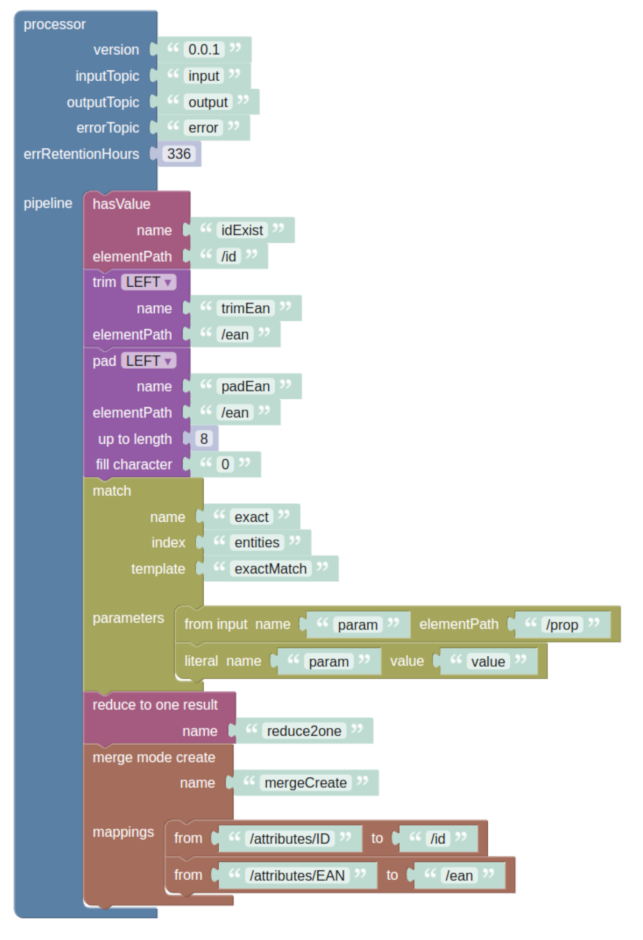

# Processor Configuration
## Implementation
Using https://github.com/fabric8io/kubernetes-client

For a processor, only a deployment is needed, a service can be left out. Later, the metrics can be kept from the pod itself using [PodMonitor](https://prometheus-operator.dev/docs/developer/getting-started/#using-podmonitors).

## Writing in Batches and Compression
```yaml
spring:
  cloud:
    stream:
      kafka:
        default:
          producer:
            compression-type: lz4
            configuration:
              batch.size: 131072
              linger.ms: 50
```
## App Props
```yaml
spring.cloud.stream.default.group: ${pipeline-name}
spring.cloud.stream.bindings.fnFlowComposedFnBean-in-0.destination: ${source-topic}
spring.cloud.stream.bindings.fnFlowComposedFnBean-out-0.destination: ${out-topic}
spring.cloud.stream.bindings.fnFlowComposedFnBean-out-1.destination: ${error-topic}
spring.cloud.stream.kafka.binder.autoAlterTopics: true
spring.cloud.stream.kafka.bindings.fnFlowComposedFnBean-out-0.producer.topic.properties.retention.ms: -1
spring.cloud.stream.kafka.bindings.fnFlowComposedFnBean-out-0.producer.topic.properties.cleanup.policy: compact
spring.cloud.stream.kafka.bindings.fnFlowComposedFnBean-out-0.producer.topic.properties.min.compaction.lag.ms: ${compaction-lag}
spring.cloud.stream.kafka.bindings.fnFlowComposedFnBean-out-1.producer.topic.properties.retention.ms: ${retention}
```

## Via ENV
- Kafka broker adress
- Opensearch uri

## Kubernetes
- unique label to identify all pipeline pods

## Create or Update a Processing Pipeline
POST /pipelines/{name}
```json
{
  "version": "app-version",
  "sourceTopic": "source-topic-name",
  "entityTopic": "entity-topic-name",
  "errRetentionHours": <error retention in hours>,
  "outCompactionLagHours": <compaction hold time in hours> 
  "pipeline": [
    {
      "name": "function-name",
      "function": "function",
      "parameters": {
        ...
      }
    },
    ...
  ]
}
```

## Delete a Processing Pipeline
DELETE /pipelines/{name}

## Get a Processing Pipeline Config
GET /pipelines/{name}

## Get all pipelines

GET /pipelines


# FnFlow UI Experiment
Here we try to implement a UI for clicking together a processor configuration. It is based on [Blockly](https://developers.google.com/blockly).

## Custom Blocks
The static [web page](src/main/resources/static/index.html) is providing a Blockly workspace with custom blocks for processor configuration. Following an example configuration created in this workspace:

With this experimental implementation, we take some compromises:
- the dataflow general layout is vertical (data flowing from top to bottom) instead of the usual horizontal layout (data flowing from left to right).
- property lists are rendered as Blockly statements instaed as of list of Inputs. This is far easier to implement but breaks the programming model of Blockly.
- only limited validation is implemented

## Code Generation
A custom code generator will be implemented creating the request body for the `POST manager/pipelines/{name}` endpoint.
It is based on: https://github.com/google/blockly-samples/blob/master/codelabs/custom_generator/custom_generator.md
